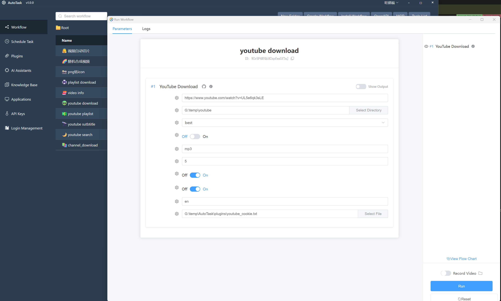

# AutoTask YouTube Plugin

English | [简体中文](readme_zh.md)

A powerful YouTube download plugin based on youtube-dl library, providing functionality for downloading videos, playlists, channels, and extracting subtitles.

## Usage

This plugin can be used in two ways:

1. **Through AutoTask Software Interface**

You can get and use this plugin through:
- Search and install "YouTube Download Tool" plugin in AutoTask's plugin section
- Or download workflows containing YouTube functionality, which will automatically install required plugins

After installation, you can use all features through the graphical interface:



2. **Through MCP API**

AutoTask has a built-in MCP server. After installing the plugin, you can call plugin functions from other programs via the MCP interface:
- MCP server address: `http://localhost:8283/mcp/sse`
- Copy this address to Cursor or other development environments to use plugin functions via MCP protocol

## Features

- Download single videos, playlists, and entire channels
- Extract video information (title, description, duration, etc.)
- Download subtitles (including auto-generated ones)
- Extract audio (multiple formats and quality options)
- Search YouTube videos
- Support for login-required videos (via cookies)
- Customizable output format and quality
- Resume downloads and error retry

## Requirements

1. Install dependencies:
```bash
pip install -r requirements.txt
```

2. Make sure ffmpeg is installed on your system (for audio extraction and format conversion)

## Available Nodes

### YouTube Download Node (YouTubeDownloadNode)

Downloads a single YouTube video.

**Inputs:**
- `url` (required): URL of the YouTube video
- `output_dir`: Directory to save the downloaded video
- `format`: Format code for the video (e.g., 'best', 'bestvideo+bestaudio', 'mp4')
- `extract_audio`: Whether to extract audio from the video
- `audio_format`: Format for the extracted audio (e.g., 'mp3', 'm4a')
- `audio_quality`: Quality of the extracted audio (0-9, where 0 is best)
- `write_subs`: Whether to download subtitles
- `write_auto_subs`: Whether to download auto-generated subtitles
- `sub_langs`: Subtitle languages (e.g., 'en,zh-CN', use 'all' for all languages)
- `cookie_file`: Path to a cookie file for authentication

**Outputs:**
- `file_path`: Path to the downloaded file
- `title`: Title of the downloaded video
- `duration`: Duration of the video in seconds
- `subtitle_files`: List of paths to downloaded subtitle files

### YouTube Playlist Download Node (YouTubePlaylistDownloadNode)

Downloads all videos from a YouTube playlist.

**Inputs:**
- `playlist_url` (required): URL of the YouTube playlist
- `output_dir`: Directory to save the downloaded videos
- `format`: Video format
- `extract_audio`: Whether to extract audio
- `audio_format`: Audio format
- `audio_quality`: Audio quality
- `write_subs`: Whether to download subtitles
- `write_auto_subs`: Whether to download auto-generated subtitles
- `sub_langs`: Subtitle languages
- `cookie_file`: Path to a cookie file
- `playlist_start`: Playlist video to start at (default is 1)
- `playlist_end`: Playlist video to end at (-1 for last)
- `playlist_reverse`: Download playlist videos in reverse order
- `playlist_random`: Download playlist videos in random order

**Outputs:**
- `file_paths`: List of paths to downloaded files
- `titles`: List of video titles
- `durations`: List of video durations
- `subtitle_files`: List of subtitle file paths for each video

### YouTube Channel Download Node (YouTubeChannelDownloadNode)

Downloads all videos from a YouTube channel.

**Inputs:**
Similar to playlist download node, but uses `channel_url` instead of `playlist_url`.

### YouTube Video Info Node (YouTubeVideoInfoNode)

Extracts information about a YouTube video without downloading.

**Inputs:**
- `url` (required): Video URL
- `cookie_file`: Path to a cookie file

**Outputs:**
- `title`: Video title
- `description`: Video description
- `duration`: Video duration
- `uploader`: Channel name
- `upload_date`: Upload date
- `view_count`: Number of views
- `like_count`: Number of likes
- `comment_count`: Number of comments
- `formats`: List of available formats
- `raw_info`: Raw information in JSON format

### YouTube Subtitle Download Node (YouTubeSubtitleDownloadNode)

Specifically for downloading video subtitles.

**Inputs:**
- `url` (required): Video URL
- `output_dir`: Directory to save subtitles
- `languages`: List of languages to download
- `auto_generated`: Include auto-generated subtitles
- `cookie_file`: Path to a cookie file

**Outputs:**
- `subtitle_files`: List of paths to downloaded subtitle files
- `available_languages`: List of available subtitle languages

### YouTube Search Node (YouTubeSearchNode)

Searches for videos on YouTube.

**Inputs:**
- `query` (required): Search query
- `max_results`: Maximum number of results
- `cookie_file`: Path to a cookie file

**Outputs:**
- `video_urls`: List of video URLs
- `titles`: List of video titles
- `descriptions`: List of video descriptions
- `durations`: List of video durations

## Cookie File Authentication

To download age-restricted or private videos, you need to provide a cookie file from your browser. You can export cookies using browser extensions like "Get cookies.txt" or "Cookie-Editor".

Supported cookie file formats:
1. Netscape format .txt files
2. JSON format cookie files (will be automatically converted to Netscape format)

## Important Notes

1. Ensure sufficient disk space for downloaded videos
2. For large playlists or channels, consider using `playlist_start` and `playlist_end` for batch downloads
3. If download speed is slow, try different video formats
4. For restricted videos, make sure to provide a valid cookie file
5. All subtitles will be saved in VTT format

## License

This plugin is licensed under the MIT License. See the LICENSE file for details.

AutoTask.dev

AutoTask.dev User Id: buKkhpRSxA9LT4zZ6GDKH9
